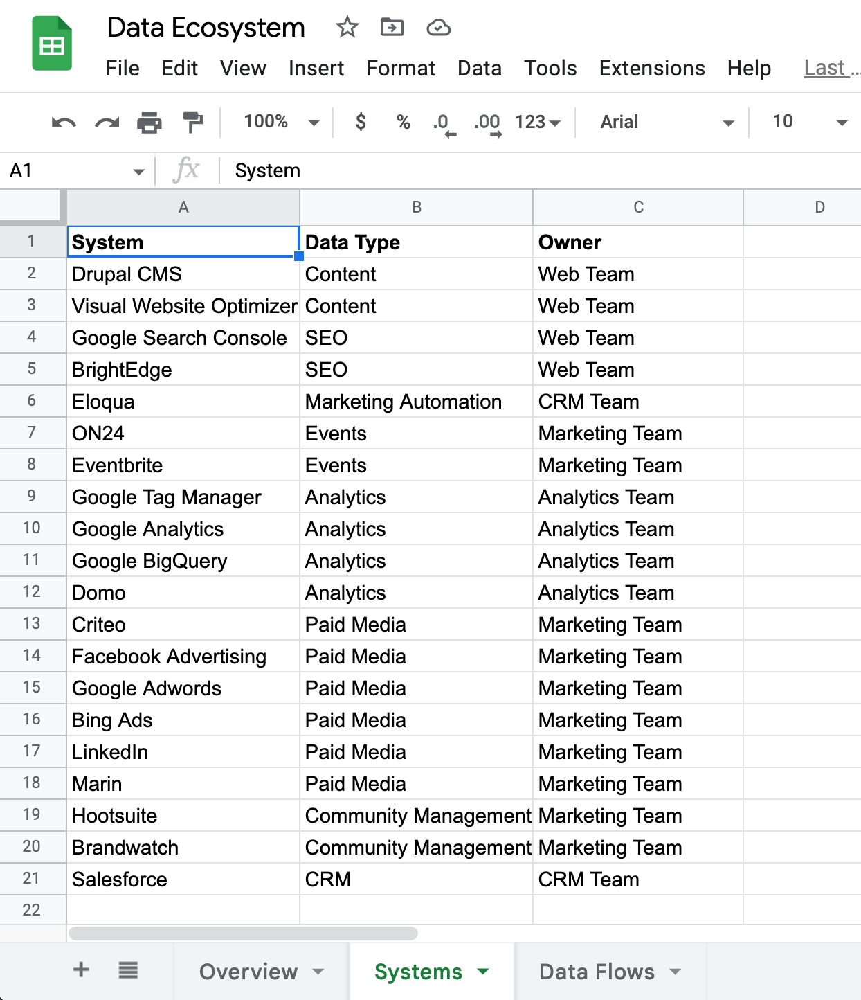
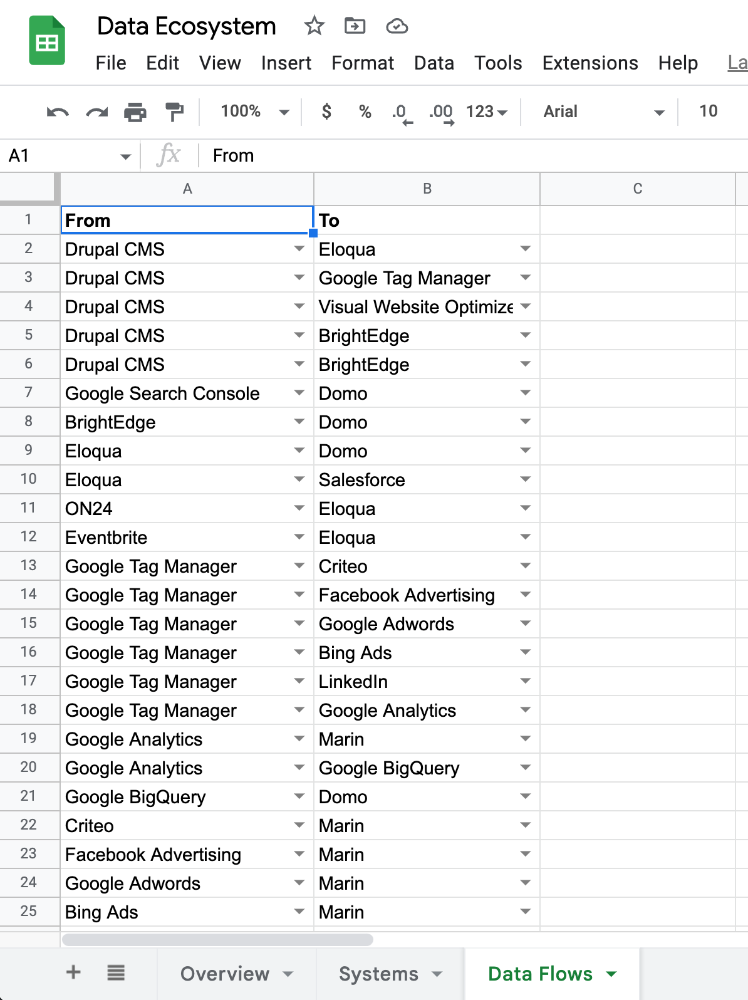

# Interactive Network Diagram Generator

This is an R script (R Notebook) that can be used to generate a visualization of data sources and the data flows between them using data from Google Sheets.

The output is a self-contained interactive HTML document that looks like the following:

## Reference

See http://kateto.net/network-visualization for some details. Ultimately, it's all hinging on the visNetwork package, which has a number of different functions for adjusting the actual visualization.

## Input

The script pulls from a Google Sheet. The Google Sheets document used in the script is at <https://docs.google.com/spreadsheets/d/14QZbaKMNqGAGQpOPRZDZeHdb9H8kb19Vbv1VBItvpPs/edit?usp=sharing>. You will want to:

1.  Make a copy of that and modify it for your own needs
2.  Make it public (it can be unlisted; it doesn't *have* to be public, but you'll need to tweak the script to support auth if it's not), and
3.  Grab the ID from the URL and update the `googlesheets_id` value in the script.

If that link doesn't work, it can be recreated (with a different ID) by hand or by uploading the [Excel file in this repo](resources/data-ecosystem.xlsx) to Google Drive and converting to Google Sheets. The two tabs with the data that goes into the diagram are shown below (the structure and worksheet names matter; the actual values, obviously, can be changed to suit your needs).

The first tab is a **Systems** worksheet that lists all of the systems that will become the "nodes" in the network diagram. This can have any number of additional columns that describe each data source, and the script can be tweaked to incorporate those (as node names, labels, etc.):

The second tab is the **Data Flows** worksheet that actually provides the data that will become the "edges" in the network diagram (the lines between the nodes). These are directional, and the values in the first two columns _must_ be exact matches to the values in the first column on the **Systems** worksheet. But, again, additional columns can be added to include additional meta data regarding each edge as needed:

## Running the Script

If the Google Sheet is set up and the `googlesheets_id` updated, then it should simply be a matter of running all of the chunks in `network-diagram.Rmd`. If you save that notebook after it's run, you should have a `network-diagram.nb.html` as output (you can manipulate the chunk options in the notebook to surpress all of the code by adding `echo = FALSE` to every chunk). 

